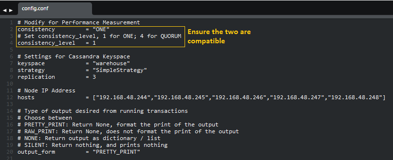
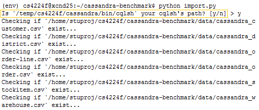

### Prerequisites

The code uses Python (Python 2.7.5), or more specifically, DataStax Python Driver for Apache Cassandra

We will assume that you are using a Linux-based system, or at least have access to a Linux-based terminal

In summary, ensure the following:

* virtualenv (Ensure that the Python package is working)
* File path for `cqlsh`
* `cassandra` running on all nodes
* [Dataset](http://www.comp.nus.edu.sg/~cs4224/4224-project-files.zip)

Refer to the section [Setting up virtualenv](#set_virtualenv), and [Obtaining File Path of cqlsh](#get_cqlsh) for help.

<hr/>

### <a name="set_virtualenv"></a> Setting up virtualenv

The following code will circumvent the restriction where users are not able to use `pip` to install the package in `/usr/lib/python2.7/site-packages`

1. Download the `virtualenv` source code, and run the script locally. At the end, you should get the full path of the file, `virtualenv.py`

```
$ curl -O https://pypi.python.org/packages/source/v/virtualenv/virtualenv-1.9.tar.gz
$ tar xvfz virtualenv-1.9.tar.gz
$ cd virtualenv-1.9
$ realpath virtualenv.py
$ # The full path of virtualenv.py will be obtained, take note of the path
$ # A possible output: /home/stuproj/cs4224f/virtualenv-1.9/virtualenv.py (results will vary)
```

2. Ensure that the `virtualenv.py` is executable

```
$ chmod +x virtualenv.py
```

<hr/>

### <a name="get_cqlsh"></a> Obtaining File Path of cqlsh

1. Run the following script to get all the possible path of cqlsh
```
$ whereis cqlsh
$ # Possible output
$ # cqlsh: /temp/cs4224f/cassandra/bin/cqlsh /temp/cs4224f/cassandra/bin/cqlsh.bat
```

1a. Alternatively, use the following to determine the full path of the executable `cqlsh`

```
$ which cqlsh
```

2. Ensure that the full path of the executable permits you to run query on it. To test, use the following
```
$ <cqlsh's path> -e DESCRIBE keyspaces;
```

<hr/>

### Setup

0. Download and unzip the project repository - we assume that the project repository zip file downloaded is `cs4224f-cassandra-master.zip`, however, this might change in the future.

```
$ # Assume that the project directory is placed in the home directory
$ cd ~
$ # Assume the project folder is called cs4224f-cassandra-master.zip
$ # However, this assumption may not hold in future release - hence make changes accordingly
$ unzip cs4224f-cassandra-master.zip
```

1. Create an environment directory, `env`. We assume that you have set up virtualenv using the above - hence replace the variable \<virtualenv\> with the full path of the file, `virtualenv.py`. Otherwise, you may simply replace \<virtualenv\> with `virtualenv`.

```
$ # Ensure that you are at the root of the project repository
$ cd ~/cs4224f-cassandra-master.zip
$ <virtualenv> env
$ # The following is an example
$ # /home/stuproj/cs4224f/virtualenv-1.9/virtualenv.py env
```

2. Install all dependencies in requirement.txt

```
$ source ./env/bin/activate
(env) $ # You should see (env) prepended to the command prompt
(env) $ pip install -r requirements.txt
```

3. Download the dataset if you have not, and move them to `/data` folder. Thereafter, move all transaction files to the `/xact-files/` folder.

```
(env) $ wget http://www.comp.nus.edu.sg/~cs4224/4224-project-files.zip
(env) $ unzip 4224-project-files.zip
(env) $ mv ./4224-project-files/data-files/*.csv ./data
(env) $ mv ./4224-project-files/xact-files/* ./xact-files/
```

4. Set up the configuration file. `config.conf`. Note that the `consistency` and `consistency_level` must not contradict. That is, if `consistency_level` is set at `1`, then `consistency` __MUST__ be set at `ONE`; if `consistency_level` is set at `4` `consistency` __MUST__ be set at `QUORUM`



4a. Note that the number of clients will be used as an argument for a script in the `total_act_test.sh` and hence, may not be configurable from the `config.conf` file.

5. Run `import.py` to import the data into cassandra

```
(env) $ python import.py
```

6. You will be prompted to confirm the correct `cqlsh` path



7. By the completion of the script, the data would have been imported into the cassandra database. To repeat the experiment with different configuration, run step 4 to step 6 with different `config.conf`

<hr/>

### Running Cassandra Benchmarking

1. Ensure that all the nodes are logged in (i.e. that you have access to all the nodes), and that they are currently in the root of the project directory. Assign each node a number starting from 0, in increasing order.

2. On each node, run `total_act_test.sh {0.. Number of node - 1} {$NC}`. For instance,

```
$ total_act_test.sh 7 40
```

3. At the end of it, collect the output file, `{0.. Number of node - 1}-state.txt` from each node.

<hr/>

### Exit

* To exit Cassandra

```
$ ps auwx | grep cassandra
$ # Get the pid; remember the pid - we will be using it later
$ kill pid
```

* To exit the env

```
(env) $ deactivate
```
